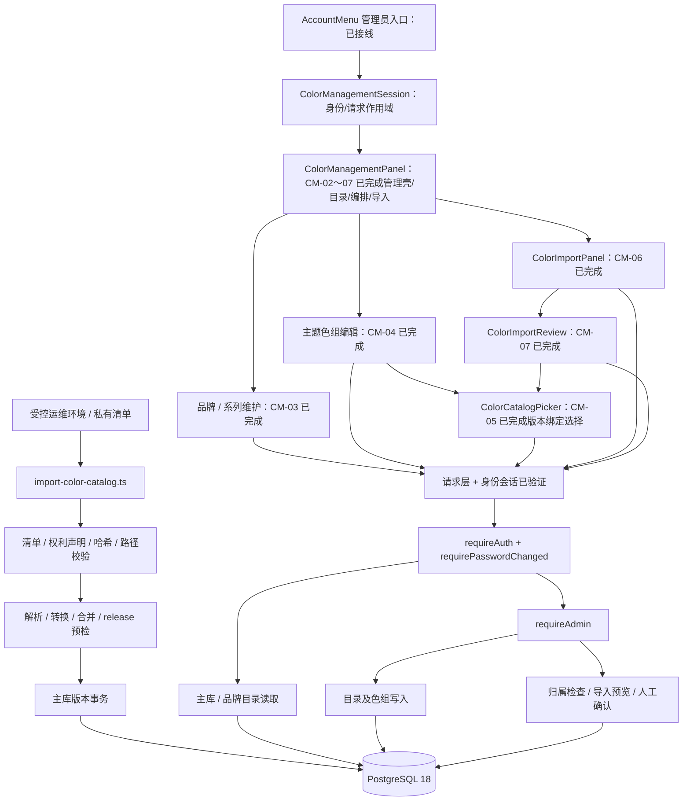
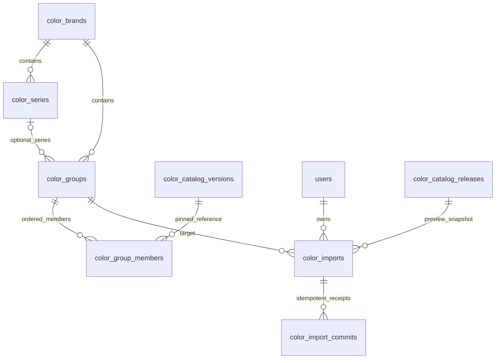

# 色彩管理架构与接口边界

**范围：** 原任务 #7；基于 2026-09-14 `ui-design` 当前未提交工作区。CM-00～08 已实现并验收；本文记录最终管理流程边界。

相关：[开发计划](./development-plan.md) · [周期](./schedule.md) · [TODO](./TODO.md)

## 1. 分层架构



核心原则：HTTP 不提供主库写入口；前端不解析 Adobe/Excel；不新增一套业务 Store；组件状态不进入 `ProjectTab[]` 或 `DocumentSnapshot`。

## 2. 模块职责与状态

| 层 | 文件 | 状态与职责 |
| --- | --- | --- |
| 来源与主库 | `server/lib/adobeSwatches.ts`、`colorScience.ts`、`colorCatalog.ts` | 已实现：解析、带假设的显示转换、身份合并、近似候选 |
| 受控初始化 | `server/lib/colorCatalogManifest.ts`、`colorCatalogRelease.ts`、`scripts/import-color-catalog.ts` | 已实现：外部清单、校验、默认 dry-run、显式 apply |
| 主库持久化 | `server/lib/colorCatalogMigration.ts`、`colorCatalogStore.ts` | 已实现：迁移 19、不可变 release、只读查询 |
| 品牌持久化 | `server/lib/brandColorMigration.ts`、`brandColorValidation.ts`、`brandColorStore.ts` | 已实现：迁移 20、目录约束、有序成员、revision、软删除 |
| 导入 | `server/lib/colorArchive.ts`、`xlsxColorRows.ts`、`colorImport.ts`、`colorImportStore.ts` | 已实现：资源限制、预览、私有记录、人工确认事务 |
| 路由 | `server/routes/colors.ts`、`brandColors.ts`、`server/index.ts` | 已接后端鉴权边界，不等于前端已接线 |
| 共享类型 | `src/types/colorCatalog.ts`、`colorImport.ts`、`colorManagement.ts`、`brandColors.ts` | 已存在，后续优先复用 |
| 管理 UI | `ColorManagementPanel.tsx`、`ColorMetadataDialog.tsx`、`ColorGroupEditor.tsx`、`ColorCatalogPicker.tsx`、`ColorImportPanel.tsx`、`ColorImportReview.tsx` | CM-02～07 已完成目录、编排、版本绑定选择、私有预览、人工决定、部分确认与恢复 |
| 前端数据访问 | `src/lib/colorManagementClient.ts`、`ColorManagementSession.tsx` | 请求基础与身份会话已完成：ColorRequestError、可销毁 scope、AuthContext 账号/角色绑定、查询/写取消和认证边界刷新 |
| 管理入口 | `src/components/panels/AccountMenu.tsx` | 已新增管理员专用色彩入口与页签；账户容器使用本地 shadcn Dialog/Tabs，保留 usage/users/diagnostics |

## 3. 已实现的数据模型

### 3.1 主库：身份与数值版本分离

- `color_catalog_releases`：完整主库发布版本。
- `color_catalog_identities`：稳定身份，来自 libraryKey + 规范化 code。
- `color_catalog_versions`：以 `(release_id, color_id)` 保存不可变数值/来源快照。
- `color_catalog_state`：单例活动 release 与 revision；运维切换时加锁。

同 HEX 不同身份保留；同号不同来源可能形成 conflict。ready 才是可选择的已转换记录；conflict/unconverted 不能靠前端猜 HEX。

### 3.2 品牌与导入



- 品牌 kind 为 `neihe` 或 `reference`；NEIHE 根目录不可删除；活动品牌名称大小写不敏感唯一。
- 系列 year/season 可为空；主题 seriesId 可为空，非空时必须属于同一品牌。
- 主题成员按 position 有序，按 catalogId 唯一，最多 5000；引用历史 release，不跟随活动主库自动改值。
- ratio 为 null 或 0–1 数值。originalHex 可保留导入原 HEX，不替代 Pantone 身份。
- 品牌、系列、主题软删除；非空父目录拒绝删除。保留引用，不实施无提示级联删除。
- `color_imports` 保存 owner、目标组、主库 release、文件 hash、原始预览 rows、decisions、publishedRows、revision。
- 导入记录当前仅创建它的管理员可访问；正式品牌色对所有登录用户可读。若要改成管理员共享草稿，需另作权限决策。
- `color_import_commits` 使用 `(import_id, request_revision)` 保存确认回执。

## 4. HTTP 契约（当前实现）

公共前缀 `/api/colors`，全部位于 requireAuth / requirePasswordChanged 之后；响应禁用缓存。以下 ID 在 URL 使用编码后的值。

| 方法与相对路径 | 权限 | 输入 / 输出要点 |
| --- | --- | --- |
| GET `/catalog/state` | 登录 | releaseId、revision |
| GET `/catalog/libraries` | 登录 | 可带 releaseId；主库系列列表 |
| GET `/catalog` | 登录 | q、libraryKey、status、hue、releaseId、limit、offset；返回 colors、releaseId、activeReleaseId、revision、total、nextOffset |
| GET `/catalog/:id` | 登录 | 可带 releaseId；返回详情 |
| GET `/brands` | 登录 | limit/offset；items、nextOffset |
| POST `/brands` | 管理员 | name；创建 reference 品牌 |
| PATCH `/brands/:id` | 管理员 | name、revision |
| DELETE `/brands/:id` | 管理员 | revision |
| GET `/series` | 登录 | brandId、limit、offset |
| POST `/series` | 管理员 | brandId、name、year?、season? |
| PATCH `/series/:id` | 管理员 | revision，以及需要修改的 name/year/season；未提交字段保留 |
| DELETE `/series/:id` | 管理员 | revision |
| GET `/groups` | 登录 | brandId、可选 seriesId、limit、offset；省略 seriesId 表示全部，不是仅未分类 |
| GET `/groups/:id` | 登录 | 主题 metadata/revision 与完整有序 members，单一数据库语句快照 |
| POST `/groups` | 管理员 | brandId、name、seriesId?、members |
| PUT `/groups/:id` | 管理员 | name、seriesId、members、revision；完整编辑，不是仅提交当前页 |
| DELETE `/groups/:id` | 管理员 | revision |
| GET `/imports` | 管理员本人 | 分页列出本人的导入记录 |
| POST `/imports` | 管理员 | groupId、libraryKey、format、base64；返回私有预览，所有决定默认 pending |
| GET `/imports/:id` | 管理员本人 | 完整原始行、决定和已发布行 |
| PATCH `/imports/:id` | 管理员本人 | revision、完整 decisions 数组 |
| POST `/imports/:id/confirm` | 管理员本人 | revision、groupRevision；返回 importId、groupId、importRevision、groupRevision、added |

普通目录分页默认 50、上限 100，offset 上限 50000。主库 q 当前按色号查询；不把来源 rawName 当作已经可搜索的独立颜色名称。

### 写入形状

复用 `src/types/brandColors.ts` 的类型，不把读取摘要整包回传为写入字段：

```ts
// 主题 members 的输入；数组顺序就是保存顺序。
type BrandColorReference = {
  catalogId: string;
  releaseId: string;
  ratio: number | null;
};

// 每条导入决定；数组长度必须等于原始 rows 长度。
type ImportColorDecision =
  | { action: "pending" | "skip" }
  | { action: "confirm"; catalogId: string; ratio: number | null };
```

输入不接受客户端自填的显示 HEX 或只读字段。映射必须存在于导入 release、属于选定 libraryKey，且可转换。服务器允许管理员显式修正无效/未匹配行；不能把候选排名当成确认。

### 错误与客户端动作

- 400：格式、字段、比例、身份、重复、资源限制等无效；保留输入，提示修正/拆分。
- 401/403：认证、密码或角色边界；遵循现有账户处理，不继续后台写入。
- 404：资源不存在或他人私有导入；不泄露存在性。
- 409：revision 冲突、主库更新、非空目录、不可改写已发布行等；显示原因，不静默覆盖。
- 429：导入入口限流；允许明确重试，不自动循环提交。
- 网络结果未知：普通色组 CRUD 持久显示未知状态并禁止盲目重提；已有组重读服务器版本，新建组刷新目录后核对。导入确认请求仍保存原请求快照并重放同一 revision。

## 5. 导入状态与事务

```text
上传 → 保存私有预览（pending，不发布）
     → PATCH decisions（人工选择/跳过/继续待查，revision + 1）
     → confirm(import revision, group revision)
         ├─ 本 revision 有回执 → 返回原回执，不追加
         ├─ 主库/组/导入版本不符 → 拒绝，不覆盖
         └─ 追加尚未发布的 confirm 行
              → 更新组 revision
              → 更新 publishedRows 与 import revision
              → 写确认回执
              → 同事务提交
     → 未确认行可继续核对；已发布行留痕，不能在原记录改写
```

确认锁顺序为主库状态 → 品牌 → 主题组 → 导入。目录写入先锁品牌；导入决定编辑只锁自身并校验，不反向取得组锁。后续修改必须保持一致，避免引入死锁。

主库发生更新时，历史已发布主题仍引用旧 release；旧预览的新增确认被拒绝，界面需解释重新导入。比例不会补到 100%，重复 catalogId 不能被追加。

## 6. 资源与安全限制

- 运维清单：最多 64 来源，单源 16 MiB、合计 64 MiB，校验 SHA-256、路径、普通文件、符号链接及权利声明；权利声明不是版权许可证明。
- 管理员上传：解码文件不超过 10 MiB，base64 规范校验；只接受 XLSX/ASE；每次最多 5000 行，导入 POST 限流 20 次/分钟。
- ZIP/XML：单条解压 8 MiB、合计 32 MiB、200 条目；拒绝宏、外链、DTD、重复/越界条目；沿用现有解析上限。
- 预览：在分组路径拼接前进行保守文本展开预算，并保留 16 MiB 实际 rows JSON 检查；不能只在巨大字符串生成后检查。
- 候选：未匹配行数 × ready TCX 候选数超过 2,000,000 时拒绝并要求拆分。近似匹配不是免费无限计算。
- 原始文件不进入公开仓库；浏览器只拿当前授权数据；日志不输出整个导入内容或秘钥。

## 7. 前端状态设计（按 CM-02～07 逐项落地）

| 状态 | 持有者 | 约束 |
| --- | --- | --- |
| 用户身份、角色 | 现有 AuthContext | 切换身份隔离管理组件；服务端仍负责最终权限 |
| 品牌/系列/主题选择、目录页码 | ColorManagementPanel | 纯 UI 状态；切换前处理 dirty；不进入项目 Store |
| 名称、比例文本、有序成员、base revision | ColorGroupEditor | 完整数组保留；分页只影响渲染；保存失败不清空 |
| 色库/查询/页码/pinned release | ColorCatalogPicker | 分页绑定同一 release；导入限定库与版本 |
| 文件、编码、上传中 | ColorImportPanel | 临时浏览器状态；服务端创建记录后以 importId 恢复 |
| 原始预览、decisions、已发布行、请求快照 | ColorImportReview | 服务端记录是真实持久化；本地未保存决定和已保存版本分开 |

请求层已提供 scopeKey 和 requestError；CM-02 已将入口绑定 AuthContext，并在切换/卸载时 dispose 查询和写作用域。取消写请求不代表服务端回滚，重新进入时按服务端状态查询。CM-05 已将选择器 props 固化为 `libraryKey?`、`releaseId?`、`disabled?`、`selectedCatalogIds?`、`maxReached?`、`onSelect`；普通编辑先读取活动 release 并在分页中固定，筛选/搜索重新取快照，导入可固定库与版本，响应 release 不一致时不展示或确认颜色。选择器不负责保存色组。目录导航与编辑器共用离开确认机制，但不引入全局状态管理框架。

主题仍由 data-theme / --gc-* 控制。所有标准控件用项目本地 shadcn；Canvas、收藏、生成执行链路本批不改。

## 8. 后续任务接口

- 任务 #8 消费 `GET /catalog`、目录与主题详情；还需单独迁移 ColorSwatch、收藏/旧客户端写入与快照边界。当前后端完成不代表画布已经保留 Pantone 身份。
- 任务 #9 后续可复用目录选择和确认过的品牌引用；图片分析、共享样本与权限不装入本次导入记录表。
- 生产数据进入前仍需核对来源库映射、分发权利、Chloé 人工色号确认、Ralph Lauren 缺失码及未标注年份；这些属于上线准备，不用虚构数据解除阻塞。
